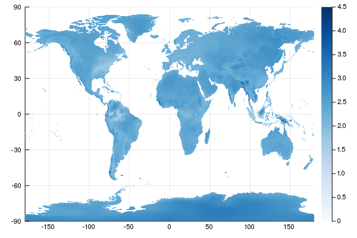
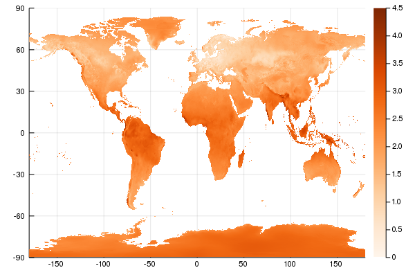
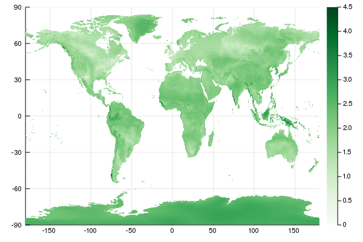

# Introduction

Ecological networks are a useful way to think about ecological systems
in which species or organisms interact [@HeleGarc14; @DelmBess18;
@PoisStou16], and recently there has been an explosion of interest in their
dynamics across large temporal scales [@BaisGrav19; @TyliMorr17], especially
alongside environmental gradients [@PellAlbo17; @TrojOles16]. As ecosystems
and climates are changing rapidly, ecologists realized that networks are at
risk or unravelling, being invaded by exotic species that can destabilize
them [@MagrHolz17; @StroLero14], or adopt entirely novel configurations
[@HuiRich19; @GuidBart19]. Simulation studies seem to suggest that knowing
the shape of the extant network is not sufficient [@ThomGonz17], and that it
needs to be supplemented by additional data on species properties, climate,
and climate projection.

This renewed interest in ecological networks has prompted several
methodological efforts. First, an expansion of the analytical tools to study
ecological networks and their variation in space [@PoisCana12; @PoisStou15;
@PoisGuev17]. Second, improvements in large-scale data-collection,
through increased adoption of molecular biology tools [@EitzAbre19;
@EvanKits16]  and crowd-sourcing of data collection [@BahlLand16; @RoyBaxt16;
@PocoRoy15]. Finally, a surge in the development of tools that allow to *infer*
species interaction [@MoraMati15] based on limited but complementary data
on existing network properties [@StocPois17], species traits [@GravPois13;
@DesjLaig17; @BrouGrav17; @BartGrav16], and environmental conditions
[@GravBais18]. These approaches tend to perform well in data-poor environments
[@BeauDesj16], and can be combined through ensemble modeling or model
averaging to generate possibly more robust predictions [@PomeThom18]. The
later task of inferring interactions is particularly important, knowing that
ecological networks are difficult to adequately sample in nature [@Jord16;
@BanaCatt04; @ChacVazq12; @GibsKnot11].

The common goal to these efforts is to facilitate the prediction of network
structure, particularly over space, both extant [@PoisGrav16; @GravBais18;
**MARINE FOODWEB**] and future [@AlboVele14], and to appraise its possible
variation in response to environmental changes. All of these developments
share the need to be supported by state of the art data management: novel
quantitative tools demand a higher volume of network data; novel collection
techniques demand powerful data repositories; novel inference tools demand
easier integration between different types of data, including but not limited
to interactions, species traits, taxonomy, occurrences, and local bioclimatic
conditions. In short, advancing the science of ecological networks requires
not only to increase the volume of available data, but to pair it with
ecologically relevant metadata, in a way that facilitates programmatic
interaction so that they can be consumed by data analysis pipelines.

@BorrMood14 identified network ecology as one of the fastest growing sub-field in the ecological sciences.

Synthesizing ecological data presents important challenges and also some
exciting opportunities. Mangal is well suited to offer such opportunities
in the study of ecological networks.

* A major challenge to ecological synthesis is generalizing from samples to the behaviour of ecological systems
* two obstacles to such generalizing in ecological systems: data coverage and data quality
  - data coverage: are data collected from every relevant system?
  - data quality: are data fit-for-purpose? Two particular aspects of quality
    - taxonomic resolution
    - sampling effort

**Main question**, is the data fit for purpose, what can we do and cannot do with it?

@PoisBais16 introduced `mangal.io` as a first step in this direction; in
the years since the tool was originally published, we continued development
of the data representation, amount and richness of metadata, and digitized
and standardized as much ecological data as we could find. The second major
release of this database contains over 1300 networks, 120000 interactions
across close to 7000 taxa, and represents what is to our best knowledge the
most complete collection of species interactions available. We seek to assess
the fitness for purpose of ecological networks at the global scale to support
synthesis research at large scales. Based on temporal and spatial biases in
the description of some types of interactions, we conclude that while there
is an increasing amount of available data, most of the planet's surface is
poorly described. In particular, Africa, South America, and most of Asia have
very sparse coverage. This suggests that the accuracy of synthesis efforts on
the worldwide structure or properties of ecological networks will have very
low predictive values within these areas, and reinforces the need to digitize
available information, but also prioritize sampling towards these locations.

# Global trends in ecological networks description

## Network coverage is accelerating but spatially biased

![Cumulative number of ecological networks available in `mangal.io` as a function of the date of collection. About 1000 unique networks have been collected between 1987 and 2017, a rate of just over 30 networks a year. This temporal increase proceeds at different rates for diferent types of networks; while the description of food webs is more or less constant, the global acceleration in the dataset is due to increased interest in host-parasite interactions starting in the late 1970s, while mutualistic networks mostly started being recorded in the early 2000s.](figures/figure_01_a.png){#fig:temporal}

The earliest recorded ecological networks date back to the late nineteenth
century, with a strong increase in the rate of collection around the 1980s
(+@fig:temporal). Although the volume of available networks has increased
over time, the sampling of these networks in space has been uneven. In
+@fig:spatial, we show that globally, network collection is biased towards the
Northern hemisphere, and than different types of interactions have been sampled
in different places. As such, it is very difficult to find a spatial area of
sufficiently large size in which we have networks of predation, parasitism,
and mutualism. The inter-tropical zone is particularly data-poor, either
because data producers from the global South correctly perceive massive
re-use of their data by Western world scientists as a form of scientific
neo-colonialism [as advanced by @MautParr13], thereby providing a powerful
incentive *against* their publication, or because ecological networks are
subject to the same data deficit that is affecting all fields on ecology
in the tropics [@CollRam08]. As @Brun10 identified almost ten years ago,
improved data deposition requires an infrastructure to ensure they can be
repurposed for future research, which we argue is provided by `mangal.io`
for ecological interactions.

{#fig:spatial}

## Different interaction types have been studied in different biomes

@Whit62 suggested that natural communities can be partitioned across
biomes, largely defined as a function of their relative precipitation and
temperature. For all networks for which the latitude and longitude was known,
we extracted the value of the first (average temperature) and twelfth (annual
precipitation) from the WorldClim 2 data [@FickHijm17]. This allows situating
every network on the map of biomes according to @Whit62 (note that because
the frontiers between biomes are not based on any empirical or systematic
process, they have been omitted from this analysis). In +@fig:biomes,
we show that even though networks, overall, capture the diversity of the
precipitation/temperature climate well, types of networks have been studied
in sub-spaces only. Specifically, parasitism networks have been studied in
colder and drier climates; mutualism networks in wetter climates; predation
networks display less of a bias.

{#fig:biomes}

Scaling up this analysis to the 19 BioClim variables in @FickHijm17, we
extracted the position of every network in the bioclimatic space, conducted
a principal component analysis on the scaled bioclimatic variables, and
measured their distance to the centre of this space ($\mathbf{0}$). This
is essentially a measurement of the "rarity" of the bioclimatic conditions
in which any networks were sampled, with larger values indicating more
unique combinations (the distance was ranged to $]0;1]$ for the sake of
interpretation). As shown in +@fig:ecc, mutualistic interactions tend to
have values that are higher than both parasitism and predation, suggesting
that they have been sampled in more original environments.

{#fig:ecc}

## Some locations on Earth have no climate analogue

Climate analogue 

{#fig:mutu}
{#fig:para}
{#fig:pred}

# Conclusions

## Data quality: sampling effort and taxonomy

@Jord16a -- importance of taxonomic resolution

Sampling effort and taxonomic detail are two very challenging but important part of any ecological dataset. The datasets in Mangal represent some of the most detailed studies of ecological networks available.
* measures of network structure may be particularly sensitive to the amount of sampling effort
* repeat sampling may be necessary to capture a "saturation" of interactions.
* we present some visualization of the sampling coverage of Mangal [tk]
* High taxonomic resolution is difficult to achieve in ecology, especially depending on the sampling method used (e.g. gut contents vs observations). We present a breakdown of the taxonomic resolution of Mangal.
* Ecological networks occur in various kinds, but they are not all equally well sampled. We present a breakdown of the number of parasitic, mutualistic and predator-prey networks sampled in Mangal
<!-- perhaps this could be a 3-panel figure -->

## Can we predict the future of ecological networks under climate change?

Perhaps unsurprisingly, most of our knowledge on ecological networks is
derived from data that were collected after the 1990s (+@fig:temporal). This
means that we have worryingly little information on ecological networks
dating before the acceleration of the climate crisis, and therefore lack a
robust baseline. @DalsTroj13 provide strong evidence that the extant shape
of ecological networks emerged in part in response to historical trends in
climate change; in this perspective, the lack of reference data before the
acceleration of the effects of climate change is of particular concern,
as we may be deriving intuitions on ecological networks structure and
assembly rule from networks that are in the midst of important ecological
disturbances. Although there are some research on the response of co-occurrence
and indirect interactions to climate change [@ArauRoze11; @LosaScho17],
these are a far cry from actual direct interactions; similarly, the data
on "paleo-foodwebs", *i.e.* from deep evolutionary time [@MuscPrab18;
@YeakPire14; @NenzMont14] represent the effect of more progressive change,
and may not adequately inform us about the future of ecological networks
under severe climate change.

@GianCost17 we already know that CC will disrupt services provided by species
interactions + accelerate the mismatch @DamiToug19 -- what about climatic
debt with a very large number of species as in @Devivan12 ?

Possibly more concerning is the fact that the spatial distribution
of sampled networks shows a clear bias towards the Western world,
specifically the Atlantic coast of the USA and Canada, and Western Europe
(+@fig:spatial). While this can to some degree be circumvented by working on
the networks sampled in places that are close analogues to regions without
direct information (almost all of Africa, most of South America, a large part
of Asia), @fig:analog suggests that this approach will rapidly be limited:
the diversity of bioclimatic combinations on Earth leaves us with some areas
lacking suitable analogues. These regions are expected to bear the worse of
the socio-economical (*e.g.* Indonesia) or ecological (*e.g.* polar regions)
consequences of climate change. All things considered, our current knowledge
about the structure of ecological networks at the global scale leaves us
under-prepared to predict their response to a warming world.

## What purpose are global ecological network data fit for?

This begs the question of *what* can be achieved with our current knowledge
of ecological networks. **TK**

## Active development and data contribution
This is an open-source project: all data and all code supporting this are available on the Mangal project GitHub organization. Our hope is that the success of this project will encourage similar efforts within other parts of the ecological community.
In addition, we hope that this project will encourage the recognition of the contribution that software creators make to ecological research.

# References
