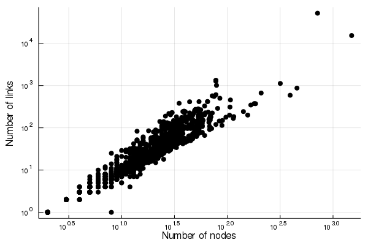
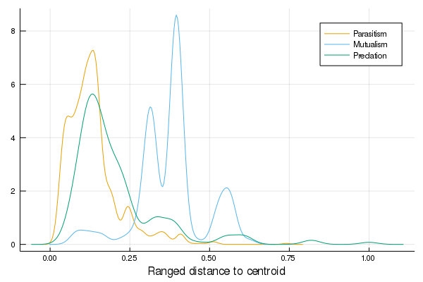
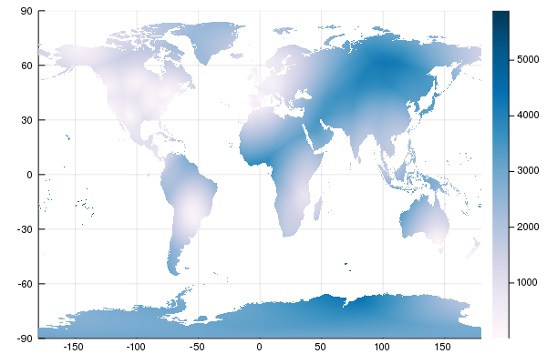

# Introduction

Ecological networks are a useful way to think about ecological systems
[@PoisStou16], and recently there has been an explosion of interest in
them. This interest has motivated two efforts: an expansion of the tools
used to investigate ecological networks, and an increase data collection
efforts. In order for both of these efforts to progress, we need a means for
ecologists to share and access high-quality network data. Mangal responds to
this need, by providing an online database of open network data. Our purpose
in the current document is threefold:

1. to describe updates and improvements to the Mangal project
2. to demonstrate the kinds of analyses possible through worked examples
3. to highlight the need for more empirical network data, especially in undersampled regions.

## Synthesis on ecological networks is rising

@BorrMood14

Synthesizing ecological data presents important challenges and also some
exciting opportunities. Mangal is well suited to offer such opportunities
in the study of ecological networks.

* A major challenge to ecological synthesis is generalizing from samples to the behaviour of ecological systems
* two obstacles to such generalizing in ecological systems: data coverage and data quality
  - data coverage: are data collected from every relevant system?
  - data quality: are data fit-for-purpose? Two particular aspects of quality
    - taxonomic resolution
    - sampling effort

## The need for an integrated networks database

Mangal is an actively developed project which has recently been expanded
and improved. @PoisBais14 -- original mangal paper

* An earlier manuscript (Poisot et al 2015 [tk]) described Mangal as an online platform allowing ecologists to share data about ecological networks
* New technical improvements include:
* New data
- number and amount of new information
* web API for better data access, and two packages (one in Julia, the other in R) for accessing these data.
* Mangal in its current form offers open network data that is ready to support synthesis at many scales.

<!-- I don't think these would literally be a numbered list but it might be a start -->
* _Coverage in geographic space._ Mangal now contains information from all over the world, and from every continent except Antarctica. <!-- map from vignette -->

* _Coverage in climate space_ Early ecologists identified the earth's biomes based on combinations of temperature and precipitation. Here we demonstrate that Mangal datasets have been sampled from across these different biomes. In doing so, we also demonstrate how climate data can be downloaded and combined with Mangal records. <!-- Whittaker biome plot -->

This database documents the impressive efforts of (generations of?) ecologists
who have sampled nearly every continent and climatic zone, as well as various
taxonomic groups and interaction types.

# Global trends in ecological networks description

## Network coverage is accelerating

{#fig:temporal}

## Networks follow the same scaling

@BrosOstl04 

{#fig:lssl}

## Different types of networks have been studied in different biomes

{#fig:biomes}

## Eccentricity of climate 

{#fig:ecc}

## NEED TO FIND A TITLE

Distance issues

{#fig:distance}

Climate analogue 

{#fig:analog}

# Conclusions

## reducing uncertainty through 'analogues'

When we lack direct observation of a community, often we must resort to the
use of 'analog' communities -- that is, communities which are similar in
space or environment which have been sampled.

* Communities may be similar in at least two ways -- close in space, or close in climate
* similarity may result in some (?) similarity in network structure, even if species different.
* Always some uncertainty in such comparisons
* reflects the need for more data gathering, can be used to target efforts

## Future of network ecology

call for more spatial analyses @BaisGrav19 @TyliMorr17 and on gradients @PellAlbo17 @TrojOles16

@ThomGonz17 need movement + future climate for predictions, can't do with data scarcity

Use this spatial gaps for sampling recommendations

## more complete analyses
We have only shown some high-level summaries of the data here; many possibilities remain.

## more data collection
We have demonstrated the considerable coverage of Mangal; however, our summary also highlights important data-collection needs. In particular, we need better information about (mutualists, desert food webs?)

## Active development and data contribution
This is an open-source project: all data and all code supporting this are available on the Mangal project GitHub organization. Our hope is that the success of this project will encourage similar efforts within other parts of the ecological community.
In addition, we hope that this project will encourage the recognition of the contribution that software creators make to ecological research.

## Data quality: sampling effort and taxonomy

Sampling effort and taxonomic detail are two very challenging but important part of any ecological dataset. The datasets in Mangal represent some of the most detailed studies of ecological networks available.
* measures of network structure may be particularly sensitive to the amount of sampling effort
* repeat sampling may be necessary to capture a "saturation" of interactions.
* we present some visualization of the sampling coverage of Mangal [tk]
* High taxonomic resolution is difficult to achieve in ecology, especially depending on the sampling method used (e.g. gut contents vs observations). We present a breakdown of the taxonomic resolution of Mangal.
* Ecological networks occur in various kinds, but they are not all equally well sampled. We present a breakdown of the number of parasitic, mutualistic and predator-prey networks sampled in Mangal
<!-- perhaps this could be a 3-panel figure -->

# References
